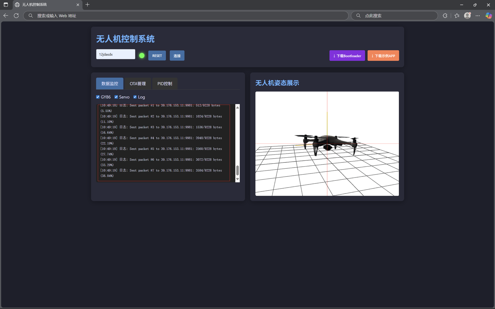
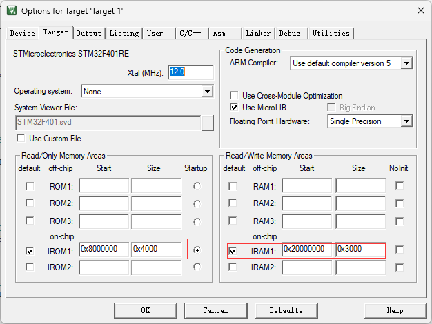

# 项目介绍

该项目初衷是为了方便UESTC嵌入式四轴无人机综设项目进行OTA升级，PID更新和无人机姿态展示（也许后续会加入其它更多功能），当然如果不需要无人机姿态展示，根据协议与服务器进行通讯，也可以实现OTA升级与PID更新（如循迹小车等项目也可以使用该项目）。

**本项目的相关配置如下：**

- <u>嵌入式</u>：开发板使用的是**STM32F401RE**（如果是其它开发板，可以在---重新设置你的配置），主频为84MHZ，WIFI模块使用了大夏龙雀的WF24-A，如果需要查看开发板发送的信息，可以再加一个CH340 USB转TTL模块

- <u>服务器端</u>：使用了阿里云服务器，系统为**ubuntu_20_04**，配置为**2核2G**

  代码方面为纯C++，使用了**cpp-httplib库**和**nlohmann的json库**与**libwebsocket库**

  最后使用**nginx**分发静态资源：网页，zip和3D模型

 - <u>前端</u>：使用的是纯HTML+JS，3D模型方面使用了**three.js**渲染，3D模型来自于FAB的[Kamilla Kraus](https://www.fab.com/sellers/Kamilla%20Kraus)（页面内容比较少，所以就偷懒没有用框架，等之后的不断更新也许会使用VUE重写一遍）

**项目名称：**

用ES作为整个项目的名称，第一层含义是：Earky's，第二层含义是ES工作室<u>（欢迎加入ES工作室）</u>

# 项目演示

主体页面如下，上方为输入设备ID，RESET键，连接，右上方为下载相关keil程序，左下方为三合一控制框，右下方为three.js渲染的无人机姿态


如果输入错误的设备ID，或者设备还未连接到服务器，则会打印如下信息，其中HTTP服务器是与WebSocket服务器在不同的进程，所以如果是正确的设备ID，将会自动更新OTA管理的文件列表，同时也可以在OTA管理中上传新固件，更新固件文件列表，下载，删除固件，设置当前更新固件


在设备连接上TCP服务器之后，即可通过前端页面连接设备，随后会自动检测STM32的固件信息是否与当前选择的固件信息相匹配，如果匹配则直接跳到原固件，如果不匹配则会更新，同时会提示更新信息（如果中途STM32与TCP服务器断开连接，则指示灯会变红，打印提示信息）



最后为PID控制，其中有三组PID可供用户操控，点击初始化PID会向STM32发送初始化信息，STM32会将当前PID返回给前端，同时更新滑动条，点击更新参数，无人机会将当前PID值更新，但是不会保存，<u>RESET之后还会回到更新前的值</u>，点击保存参数后，既会更新当前参数，也会将<u>参数保存到FLASH中</u>，断电后依旧保存


# 快速部署

如果你不关心细节的实现，可以通过快速部署以最快的速度部署一个你自己的ES-Server和ES-Boot

## 1.服务器端

进入终端输入以下命令

```shell
sudo apt-get install libpcre3 libpcre3-dev libwebsockets-dev
```

使用git clone下载项目

```shell
git clone ---
```

进入build文件夹进行编译

```
cd ES-Server/build
make
```

build文件夹中已经有create.sh脚本用于创建对应OTA设备ID，create.sh后面为8位字符串，创建完成后会生成对应的文件夹以及json文件

```shell
chmod +x create.sh
./create.sh 12345678
```

最后一步为运行服务器

```shell
chmod +x server
./server
```

server的可输入参数如下

| 参数        | 作用                    |
| ----------- | ----------------------- |
| -sWebSocket | 禁止WebSocket打印信息   |
| -sTCP       | 禁止TCP_Server打印信息  |
| -sHTTP      | 禁止HTTP_Server打印信息 |
| -silent     | 禁止三者打印信息        |

如果你需要配置端口或者单片机超时时间，可以在`define.h`中更改以下宏定义

```c
/* 服务器PORT定义 */
#define HTTP_SERVER_PORT 81
#define WEBSOCKET_PORT   9001
#define TCP_SERVER_PORT  9000

#define TIMEOUT 10              //STM32与TCP超时时间
```

## 2.前端

在js开始处配置以下IP和Port

```js
let HTTP_port = "81";
let WebSocket_port = "9001";
let Server_IP = "YOUR.BACKEND.SERVER.IP"
```

这里的HTTP_port和WebSocket_port都为后端默认的端口，如果你对后端处理HTTP或WebSocket的端口进行了更改，该port也需要更改，同时如果你的nginx的端口不为80，js中的部分url请自行修改

## 3.nginx

进入nginx文件夹并解压，解压完成后编译（这里在ES-Server我已经准备好压缩包了，如果你已经下载了nginx，可以跳过下载编译）

```shell
cd ES-Server/nginx/
tar -xvf nginx-1.25.1.tar.gz
cd nginx-1.25.1/
./configure
make&&make install
```

在`/usr/local/nginx/conf`的nginx.conf中更改以下内容：

- server_name更改为你的服务器IP

- 在server{} 中加入以下配置

```
location /monitor/ {
    alias /usr/local/nginx/html/;             
    index monitor.html;                    
}
```

在`/usr/local/nginx/html`中加入以下文件

```
monitor.html
Bootloader.zip
Sample_App.zip
```

最后启动nginx

```
cd /usr/local/nginx/sbin/
./nginx
```

## 4.嵌入式

在项目介绍中已经提到过，使用的开发板是STM32F401RE，这里主要介绍如何配置你的keil项目，如果你的开发板也是STM32F401RE，那么直接进入网页下载就可以了

- **WiFi模块配置：**

要求先用AT指令连接你需要的WiFi，同时将接收数据包模式更改为不接受数据包头，由于不同模块可能细节上有差异，需要自己查看手册

- **BootLoader配置：**

在`Serial.c`的`Serial_Init`函数中，需要更改为你对应的串口（随便找一个你以前用过的串口初始化函数，把WiFi模块接上去就可以了）

```c
/*开启时钟*/
RCC_APB2PeriphClockCmd(RCC_APB2Periph_USART1, ENABLE);	//开启USART1的时钟
RCC_AHB1PeriphClockCmd(RCC_AHB1Periph_GPIOB,ENABLE);

GPIO_PinAFConfig(GPIOB,GPIO_PinSource7,GPIO_AF_USART1);
GPIO_PinAFConfig(GPIOB,GPIO_PinSource6,GPIO_AF_USART1);

GPIO_InitTypeDef GPIO_InitStructure;
GPIO_InitStructure.GPIO_Mode = GPIO_Mode_AF; 		
GPIO_InitStructure.GPIO_OType= GPIO_OType_PP;
GPIO_InitStructure.GPIO_PuPd = GPIO_PuPd_UP; 
GPIO_InitStructure.GPIO_Speed = GPIO_Speed_50MHz;//速度50MHz
GPIO_InitStructure.GPIO_Pin = GPIO_Pin_7;
GPIO_Init(GPIOB, &GPIO_InitStructure);

GPIO_InitStructure.GPIO_Pin = GPIO_Pin_6;
GPIO_InitStructure.GPIO_PuPd = GPIO_PuPd_UP; //上拉
GPIO_Init(GPIOB, &GPIO_InitStructure);

/*USART初始化*/
USART_InitTypeDef USART_InitStructure;					//定义结构体变量
USART_InitStructure.USART_BaudRate = 115200;				//波特率
USART_InitStructure.USART_HardwareFlowControl = USART_HardwareFlowControl_None;	//硬件流控制，不需要
USART_InitStructure.USART_Mode = USART_Mode_Tx | USART_Mode_Rx;	//模式，发送模式和接收模式均选择
USART_InitStructure.USART_Parity = USART_Parity_No;		//奇偶校验，不需要
USART_InitStructure.USART_StopBits = USART_StopBits_1;	//停止位，选择1位
USART_InitStructure.USART_WordLength = USART_WordLength_8b;		//字长，选择8位
USART_Init(USART1, &USART_InitStructure);				//将结构体变量交给USART_Init，配置USART1
```

在`Serial.c`的`USART1_IRQHandler`函数中，需要更改你的服务器IP以及TCP端口（这里为后端服务器默认的9000）

```c
case WIFI:
    if(State == 0){
        Serial_SendString("AT+CIPSTART=TCP,YOUR.BACKEND.SERVER.IP,9000\r\n");
        State = 1;
    }
```

在`OTA.h`中将`OTA_Device_ID`更改为你在服务器中创建的OTA设备ID

```c
#define OTA_Device_ID	 "12345678"
```

接下来为keil项目的具体配置，首先需要配置IROM1和IRAM1的size



之后更改Flash Download中的参数


最后将function中的函数拷贝过去就可以了

**！！！这里的Delay文件为了通用性，使用了最简单的for循环，需要自己根据单片机的TIM资源进行配置，该Delay不准，不准，不准 ！！！**

- **APP项目配置：**

配置IROM1和IRAM1既size


配置User中，用来生成bin文件**（生成了project.bin文件需要自己改名成vxx.xx.bin来上传固件）**

```
fromelf --bin -o "$L@L.bin" "#L"
```


更改Flash Download中的参数


更改Linker中 R/O Base 和 R/W Base，如果无法更改，则先取消 Use Memory Layout from Target Dialog，更改完后再勾选上即可


# ES协议

由于单片机资源较少（其实是懒...），所以协议部分比较简单，ES协议分为两部分，一部分是STM32与TCP服务器的协议，一部分是TCP服务器与WebSocket服务器的协议，如果你只是作为用户，你只需要简单了解TCP -- STM32之间协议即可

## 1. TCP -- STM32

在之后的协议中，数据包中的数据以 %d %f 的形式展示，如%d %f代表一个整数+空格+一个浮点数，协议的主要格式形式如下：

| 符号类型 | uint32_t               | uint8_t  | uint24_t | --     |
| -------- | ---------------------- | -------- | -------- | ------ |
| 十六进制 | FEFE CDCD              | 00       | 00 0000  | --     |
| 含义     | 用于服务器定位到数据包 | 数据类型 | 数据长度 | 数据包 |

具体的数据类型和数据长度如下（这里省略了0xFEFECDCD，只展示后面两部分）

| 数据类型含义                              | 数据类型 | 数据长度        | 数据包                                                       |
| ----------------------------------------- | -------- | --------------- | ------------------------------------------------------------ |
| PING TCP服务器，防止超时断开连接          | 0x00     | 0               | -                                                            |
| STM32发送需要下一个数据包信息             | 0x01     | 0               | -                                                            |
| STM32初始化发送OTA ID验证                 | 0x02     | 8               | %s                                                           |
| STM32发送需要最新File Version和Length信息 | 0x03     | 0               | -                                                            |
| STM32发送日志信息                         | 0x04     | strlen(msg)     | %s                                                           |
| TCP服务器发送模拟RESET信息                | 0x05     | 0               | -                                                            |
| TCP服务器线程断开连接，安全退出           | 0x06     | 0               | -                                                            |
| STM32接收数据，并更新PID数据              | 0x07     | sizeof(float)*9 | 9个float二进制数据                                           |
| STM32接收数据，并保存PID数据              | 0x08     | sizeof(float)*9 | 9个float二进制数据                                           |
| STM32接收到初始化信息，发送当前PID数据    | 0x09     | strlen(msg)     | %f %f %f %f %f %f %f %f %f                                   |
| STM32发送GY86数据                         | 0x10     | strlen(msg)     | %d %d %d %d %d %d %d %d %d %f %f %f %f %f (前九个为GY86整数数据，前两个浮点为气压和温度，后三个为pitch, yaw, roll) |
| STM32发送舵机8路PWM数据                   | 0x11     | strlen(msg)     | %d %d %d %d %d %d %d %d                                      |

对于STM32，0x04发送日志信息已经提供了Log封装函数，对于其它数据类型，可以用以下格式发送（以GY86数据作为例子）：

```c
char msg[512];
// 数据处理
sprintf(msg, "%d %d %d %d %d %d %d %d %d %f %f %f %f %f",
							0, 0, 0, 0, 0, 0, 0, 0, 0, 1000.00, 2000.00,
							pitch, yaw, roll);
// 发送数据包头
SendPacketHeader(GY86_DATA, strlen(msg));
// 发送数据包主体
Serial_SendString(msg);
```

## 2. WebSocket -- TCP

比起上一个协议，少了一个数据包定位，因为RW_tools使用的是内存共享+互斥信号量进行数据传输，不需要数据包定位，这里只需要通过Writer和Reader封装的函数，传入数据类型和数据包就可以了，主要协议格式如下：

| 符号类型 | uint8_t  | uint24_t | --     |
| -------- | -------- | -------- | ------ |
| 十六进制 | 00       | 00 0000  | --     |
| 含义     | 数据类型 | 数据长度 | 数据包 |

具体的数据类型和数据长度如下：

| 数据类型含义                                 | 数据类型 | 数据包内容       |
| -------------------------------------------- | -------- | ---------------- |
| WebSocket接收到信息，传输到前端              | 0x04     | 需要打印的信息   |
| TCP接收到WebSocket的RESET信息发送给STM32     | 0x05     | -                |
| TCP与WebSocket一同安全退出                   | 0x06     | -                |
| TCP接收到PID数据发送给STM32                  | 0x07     | PID数据          |
| TCP接收到PID数据发送给STM32并通知STM32需保存 | 0x08     | PID数据          |
| WebSocket获得初始化PID信息发送给前端         | 0x09     | PID数据          |
| WebSocket获得GY86数据发送给前端              | 0x10     | GY86数据         |
| WebSocket获得SERVO 8路PWM数据发送给前端      | 0x11     | SERVO 8路PWM数据 |

# FLASH地址内容

FLASH的内容定义在示例APP的`PID.h`中

```c
#define PID_ADDR      0x0807FFD8
#define VM_ADDR       0x0807FFFC

#define PITCH_P_ADDR (PID_ADDR + 0x00)		//0x0807FFD8
#define PITCH_I_ADDR (PID_ADDR + 0x04)		//0x0807FFDC
#define PITCH_D_ADDR (PID_ADDR + 0x08)		//0x0807FFE0
		                                
#define YAW_P_ADDR   (PID_ADDR + 0x0C)		//0x0807FFE4
#define YAW_I_ADDR   (PID_ADDR + 0x10)		//0x0807FFE8
#define YAW_D_ADDR   (PID_ADDR + 0x14)		//0x0807FFEC
		                                      
#define ROLL_P_ADDR  (PID_ADDR + 0x18)		//0x0807FFF0
#define ROLL_I_ADDR  (PID_ADDR + 0x1C)		//0x0807FFF4
#define ROLL_D_ADDR  (PID_ADDR + 0x20)		//0x0807FFF8
```

表格如下：

| FLASH地址  | 数据类型 | 数据含义                 |
| ---------- | -------- | ------------------------ |
| 0x0807FFD8 | float    | PITCH_P                  |
| 0x0807FFDC | float    | PITCH_I                  |
| 0x0807FFE0 | float    | PITCH_D                  |
| 0x0807FFE4 | float    | YAW_P                    |
| 0x0807FFE8 | float    | YAW_I                    |
| 0x0807FFEC | float    | YAW_D                    |
| 0x0807FFF0 | float    | ROLL_P                   |
| 0x0807FFF4 | float    | ROLL_I                   |
| 0x0807FFF8 | float    | ROLL_D                   |
| 0x0807FFFC | uint32_t | (version) \|(mode << 16) |

 

